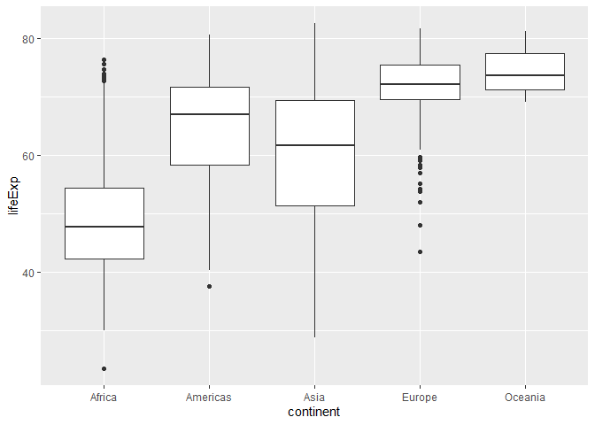
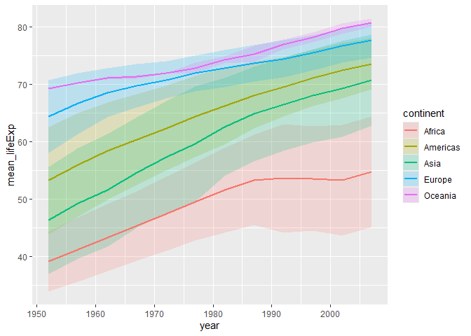

Gapminder
================
(Your name here)
2020-

- [Grading Rubric](#grading-rubric)
  - [Individual](#individual)
  - [Submission](#submission)
- [Guided EDA](#guided-eda)
  - [**q0** Perform your “first checks” on the dataset. What variables
    are in this
    dataset?](#q0-perform-your-first-checks-on-the-dataset-what-variables-are-in-this-dataset)
  - [**q1** Determine the most and least recent years in the `gapminder`
    dataset.](#q1-determine-the-most-and-least-recent-years-in-the-gapminder-dataset)
  - [**q2** Filter on years matching `year_min`, and make a plot of the
    GDP per capita against continent. Choose an appropriate `geom_` to
    visualize the data. What observations can you
    make?](#q2-filter-on-years-matching-year_min-and-make-a-plot-of-the-gdp-per-capita-against-continent-choose-an-appropriate-geom_-to-visualize-the-data-what-observations-can-you-make)
  - [**q3** You should have found *at least* three outliers in q2 (but
    possibly many more!). Identify those outliers (figure out which
    countries they
    are).](#q3-you-should-have-found-at-least-three-outliers-in-q2-but-possibly-many-more-identify-those-outliers-figure-out-which-countries-they-are)
  - [**q4** Create a plot similar to yours from q2 studying both
    `year_min` and `year_max`. Find a way to highlight the outliers from
    q3 on your plot *in a way that lets you identify which country is
    which*. Compare the patterns between `year_min` and
    `year_max`.](#q4-create-a-plot-similar-to-yours-from-q2-studying-both-year_min-and-year_max-find-a-way-to-highlight-the-outliers-from-q3-on-your-plot-in-a-way-that-lets-you-identify-which-country-is-which-compare-the-patterns-between-year_min-and-year_max)
- [Your Own EDA](#your-own-eda)
  - [**q5** Create *at least* three new figures below. With each figure,
    try to pose new questions about the
    data.](#q5-create-at-least-three-new-figures-below-with-each-figure-try-to-pose-new-questions-about-the-data)

*Purpose*: Learning to do EDA well takes practice! In this challenge
you’ll further practice EDA by first completing a guided exploration,
then by conducting your own investigation. This challenge will also give
you a chance to use the wide variety of visual tools we’ve been
learning.

<!-- include-rubric -->

# Grading Rubric

<!-- -------------------------------------------------- -->

Unlike exercises, **challenges will be graded**. The following rubrics
define how you will be graded, both on an individual and team basis.

## Individual

<!-- ------------------------- -->

| Category | Needs Improvement | Satisfactory |
|----|----|----|
| Effort | Some task **q**’s left unattempted | All task **q**’s attempted |
| Observed | Did not document observations, or observations incorrect | Documented correct observations based on analysis |
| Supported | Some observations not clearly supported by analysis | All observations clearly supported by analysis (table, graph, etc.) |
| Assessed | Observations include claims not supported by the data, or reflect a level of certainty not warranted by the data | Observations are appropriately qualified by the quality & relevance of the data and (in)conclusiveness of the support |
| Specified | Uses the phrase “more data are necessary” without clarification | Any statement that “more data are necessary” specifies which *specific* data are needed to answer what *specific* question |
| Code Styled | Violations of the [style guide](https://style.tidyverse.org/) hinder readability | Code sufficiently close to the [style guide](https://style.tidyverse.org/) |

## Submission

<!-- ------------------------- -->

Make sure to commit both the challenge report (`report.md` file) and
supporting files (`report_files/` folder) when you are done! Then submit
a link to Canvas. **Your Challenge submission is not complete without
all files uploaded to GitHub.**

``` r
library(tidyverse)
```

    ## ── Attaching core tidyverse packages ──────────────────────── tidyverse 2.0.0 ──
    ## ✔ dplyr     1.1.4     ✔ readr     2.1.5
    ## ✔ forcats   1.0.0     ✔ stringr   1.5.1
    ## ✔ ggplot2   3.5.1     ✔ tibble    3.2.1
    ## ✔ lubridate 1.9.4     ✔ tidyr     1.3.1
    ## ✔ purrr     1.0.2     
    ## ── Conflicts ────────────────────────────────────────── tidyverse_conflicts() ──
    ## ✖ dplyr::filter() masks stats::filter()
    ## ✖ dplyr::lag()    masks stats::lag()
    ## ℹ Use the conflicted package (<http://conflicted.r-lib.org/>) to force all conflicts to become errors

``` r
library(gapminder)
```

*Background*: [Gapminder](https://www.gapminder.org/about-gapminder/) is
an independent organization that seeks to educate people about the state
of the world. They seek to counteract the worldview constructed by a
hype-driven media cycle, and promote a “fact-based worldview” by
focusing on data. The dataset we’ll study in this challenge is from
Gapminder.

# Guided EDA

<!-- -------------------------------------------------- -->

First, we’ll go through a round of *guided EDA*. Try to pay attention to
the high-level process we’re going through—after this guided round
you’ll be responsible for doing another cycle of EDA on your own!

### **q0** Perform your “first checks” on the dataset. What variables are in this dataset?

``` r
## TASK: Do your "first checks" here!
glimpse(gapminder_unfiltered)
```

    ## Rows: 3,313
    ## Columns: 6
    ## $ country   <fct> "Afghanistan", "Afghanistan", "Afghanistan", "Afghanistan", …
    ## $ continent <fct> Asia, Asia, Asia, Asia, Asia, Asia, Asia, Asia, Asia, Asia, …
    ## $ year      <int> 1952, 1957, 1962, 1967, 1972, 1977, 1982, 1987, 1992, 1997, …
    ## $ lifeExp   <dbl> 28.801, 30.332, 31.997, 34.020, 36.088, 38.438, 39.854, 40.8…
    ## $ pop       <int> 8425333, 9240934, 10267083, 11537966, 13079460, 14880372, 12…
    ## $ gdpPercap <dbl> 779.4453, 820.8530, 853.1007, 836.1971, 739.9811, 786.1134, …

**Observations**:

- Write all variable names here
- country: fct, categorical variable
- continent: fct, categorical variable
- year: int
- lifeExp: dbl, double
- pop: int
- gdpPercap: dbl, double

### **q1** Determine the most and least recent years in the `gapminder` dataset.

*Hint*: Use the `pull()` function to get a vector out of a tibble.
(Rather than the `$` notation of base R.)

``` r
## TASK: Find the largest and smallest values of `year` in `gapminder`
year_max <- NA_real_
year_min <- NA_real_


year_min <- gapminder %>% 
  pull(year) %>% 
  min()

year_max<- gapminder %>% 
  pull(year) %>% 
  max()
```

Use the following test to check your work.

``` r
## NOTE: No need to change this
assertthat::assert_that(year_max %% 7 == 5)
```

    ## [1] TRUE

``` r
assertthat::assert_that(year_max %% 3 == 0)
```

    ## [1] TRUE

``` r
assertthat::assert_that(year_min %% 7 == 6)
```

    ## [1] TRUE

``` r
assertthat::assert_that(year_min %% 3 == 2)
```

    ## [1] TRUE

``` r
if (is_tibble(year_max)) {
  print("year_max is a tibble; try using `pull()` to get a vector")
  assertthat::assert_that(False)
}

print("Nice!")
```

    ## [1] "Nice!"

### **q2** Filter on years matching `year_min`, and make a plot of the GDP per capita against continent. Choose an appropriate `geom_` to visualize the data. What observations can you make?

You may encounter difficulties in visualizing these data; if so document
your challenges and attempt to produce the most informative visual you
can.

``` r
## TASK: Create a visual of gdpPercap vs continent
gapminder %>% 
  filter(year == year_min) %>% 
  ggplot(aes(continent, gdpPercap))+
  geom_boxplot()
```

<!-- -->

**Observations**:

- There is one country that is a significant outlier in Asia
- Oceania likely has very little data which is why the box plot has very
  little variation.
- Europe seems to have the most variation since it has the largest
  difference in its lower and upper quartile

**Difficulties & Approaches**:

- So much so that it makes all the relative median gdp for the other
  continents seem more similar than they actually are

### **q3** You should have found *at least* three outliers in q2 (but possibly many more!). Identify those outliers (figure out which countries they are).

``` r
## TASK: Identify the outliers from q2

gapminder %>% 
  filter(year == year_min, continent == "Asia", gdpPercap >= 90000) %>% 
  ggplot(aes(continent, gdpPercap, color = country))+
  geom_point()
```

<!-- -->

``` r
# Kuwait has the highest outlier??


gapminder %>% 
  filter(year == year_min, continent == "Americas", gdpPercap >= 10000) %>% 
  ggplot(aes(continent, gdpPercap, color = country))+
  geom_point()
```

<!-- -->

``` r
gapminder %>% 
  filter(year == year_min, continent == "Europe", gdpPercap >= 14000) %>% 
  ggplot(aes(continent, gdpPercap, color = country))+
  geom_point()
```

<!-- -->

``` r
gapminder %>% 
  filter(year == year_min, continent == "Africa", gdpPercap >= 4000) %>% 
  ggplot(aes(continent, gdpPercap, color = country))+
  geom_point()
```

<!-- -->

**Observations**:

- Identify the outlier countries from q2
  - Asia –\> Kuwait
  - Americas –\> United States
  - Europe –\> Switzerland
  - Africa –\> South Africa

*Hint*: For the next task, it’s helpful to know a ggplot trick we’ll
learn in an upcoming exercise: You can use the `data` argument inside
any `geom_*` to modify the data that will be plotted *by that geom
only*. For instance, you can use this trick to filter a set of points to
label:

``` r
## NOTE: No need to edit, use ideas from this in q4 below
gapminder %>%
  filter(year == max(year)) %>%

  ggplot(aes(continent, lifeExp)) +
  geom_boxplot() +
  geom_point(
    data = . %>% filter(country %in% c("United Kingdom", "Japan", "Zambia")),
    mapping = aes(color = country),
    size = 2
  )
```

<!-- -->

### **q4** Create a plot similar to yours from q2 studying both `year_min` and `year_max`. Find a way to highlight the outliers from q3 on your plot *in a way that lets you identify which country is which*. Compare the patterns between `year_min` and `year_max`.

*Hint*: We’ve learned a lot of different ways to show multiple
variables; think about using different aesthetics or facets.

``` r
## TASK: Create a visual of gdpPercap vs continent
gapminder %>%
  filter(year == year_min) %>%

  ggplot(aes(continent, gdpPercap)) +
  geom_boxplot() +
  geom_point(
    data = . %>% filter(country %in% c("United States", "Kuwait", "Switzerland", "South Africa")),
    mapping = aes(color = country),
    size = 2
  )
```

<!-- -->

**Observations**:

- It is important to dig deeper into the story of Kuwait to explain how
  its GDP, defined by the following equation, is so significantly high
  that the highest outliers for every other major continent are
  incomparable.
- GDP = Consumption + Investment + Government Spending + Net Exports 
- Due to Kuwait’s enormous oil reserves and small population, its GDP
  per capita is a surmountable ratio.

# Your Own EDA

<!-- -------------------------------------------------- -->

Now it’s your turn! We just went through guided EDA considering the GDP
per capita at two time points. You can continue looking at outliers,
consider different years, repeat the exercise with `lifeExp`, consider
the relationship between variables, or something else entirely.

### **q5** Create *at least* three new figures below. With each figure, try to pose new questions about the data.

``` r
## TASK: Your first graph
gapminder %>%
  ggplot(aes(x = continent, y = lifeExp)) +
  geom_boxplot() 
```

<!-- -->

- This shows the box plot for the life expectancy over the whole course
  of the dataset.
- My guiding question is to know what the general trend of life
  expectancy was over the course of the recorded times

``` r
## TASK: Your second graph

gapminder %>% 
  ggplot(aes(year, lifeExp, color = continent))+
  geom_point(position = "jitter")
```

<!-- -->

- This shows the distribution over the years a bit better in my opinion
- We see that theres a distinction between the general clump of Europe
  and Oceania versus Africa. However overall they seem to follow a
  similar upwards trend.

``` r
## TASK: Your third graph

gapminder %>%
  group_by(year, continent) %>%
  summarise(
    mean_lifeExp = mean(lifeExp),
    sd_lifeExp = sd(lifeExp),
    n = n(),
    se_lifeExp = sd_lifeExp / sqrt(n), 
    .groups = "drop"
  ) %>%
  ggplot(aes(x = year, y = mean_lifeExp, color = continent, fill = continent)) +
  geom_ribbon(aes(ymin = mean_lifeExp - 1.96 * se_lifeExp, ymax = mean_lifeExp + 1.96 * se_lifeExp), 
              alpha = 0.2, linetype = "blank") +  
  geom_line(size = 1) 
```

    ## Warning: Using `size` aesthetic for lines was deprecated in ggplot2 3.4.0.
    ## ℹ Please use `linewidth` instead.
    ## This warning is displayed once every 8 hours.
    ## Call `lifecycle::last_lifecycle_warnings()` to see where this warning was
    ## generated.

<!-- -->

- This graph plots the life expectancy over the years as well as a
  ribbon of the 95% confidence interval to better represent the
  variation as well
- While all the countries seem to follow a similar slope of improvement
  for life expectancy, Africa seems to stagnate in the mid 1980s.
- From a quick google search, many articles point to the spread of
  HIV/AIDs epidemic to this trend however further research is necessary.
